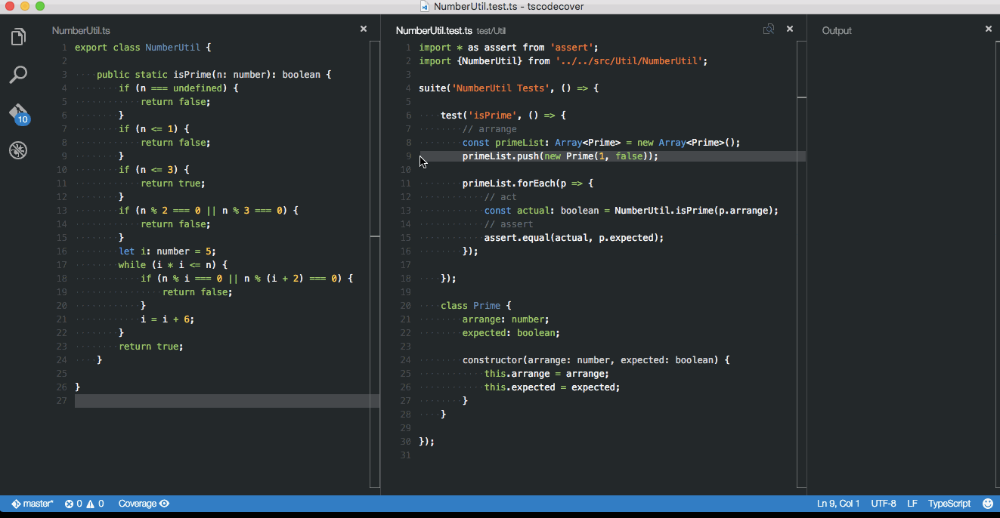

# TypeScript のコード カバレッジを Visual Studio Code で可視化する

　TypeScript のプロジェクトで，単体テスト コードが実行された／実行されていないコードを
ソース コード エディター上に色分け表示できれば，単体テストの消化効率をもっと上げれるのに，と思うことがあります。

　本稿では，TypeScript のエディターに Visual Studio Code (VS Code) を使い，コード カバレッジを VS Code 上で可視化する方法を解説します。



## Code Cover

　コード カバレッジを VS Code 上で可視化するには，[Bradley Meck](https://github.com/bmeck) 氏 (Node.js コミッター) 制作
の "[Code Cover](https://github.com/bmeck/vscode-code-cover)" を使用します。

[](https://marketplace.visualstudio.com/items?itemName=bradleymeck.codecover)

　Code Cover はシンプルな設定ファイル (coverageconfig.json) ひとつで動作する素晴らしい VS Code Extension ですが，
日本語での紹介記事はもちろん，英語での紹介記事も見つけることができない状態ですので，本稿をきっかけに少しでも多くの開発者に使っていただければ幸いです。

### Quick Start

　TypeScript のプロジェクトで Code Cover を使用するサンプル プロジェクトを GitHub のリポジトリに作成しましたので，
とにかく早く動かしたいときは `clone`，`npm install`，`npm run build` してご利用ください。

　Github, "tscodecover", https://github.com/k--kato/tscodecover.git

### Code Cover のインストール

1. コマンド パレット を開きます Cmd-Shift-P (OSX) or Ctrl-Shift-P (Windows, Linux)
1. `Extensions: Install Extension` を入力＆選択します
1. `ext install codecover` を入力します
1. VS Code を再起動します

　Code Cover はコード カバレッジの情報を元に VS Code 上にカバレッジを可視化するため，
コード カバレッジを出力する "[istanbul](https://github.com/gotwarlost/istanbul)" が必要となります。

### Code Cover の構成

```bash
tscodecover/
├── coverageconfig.json
├── package.json
├── tsconfig.json
├── tslint.json
|
├── .vscode/
|   └── tasks.json
├── coverage/
|   ├── coverage.json
|   └── lcov.info
├── src/
│   └── Util/
│       └── NumberUtil.ts
├── test/
│   └── Util/
│       └── NumberUtil.test.ts
├── out/
└── typings/
    ├── node.d.ts
    └── vscode-typings.d.ts
```

| ファイル             | 役割                       | 説明             |
|:--------------------|:--------------------------|:----------------|
| coverageconfig.json | Code Cover 設定ファイル     | coverage.json または lcov.info を指定します |
| package.json        | npm パッケージ管理ファイル    | プロジェクトに必要なパッケージの依存関係やビルド等のスクリプトを設定します |
| tsconfig.json       | TypeScript 設定ファイル     |  |
| tslint.json         | TSLint 設定ファイル         | TypeScript の文法を検証するルールを記載します |
| tasks.json          | VS Code タスク設定ファイル   | VS Code のコマンド パレットから build や test 等のコマンドを使えるように登録します |
| coverage.json       | カバレッジ結果               | Code Cover が参照します |
| lcov.info           | カバレッジ結果               | Code Cover が参照します |
| src                 | ソース コード               |  |
| test                | 単体テスト コード            |  |
| out                 | トランスパイル コード         |  |


### Code Cover の設定

coverageconfig.json
```json
{
    "coverage": ["./coverage/coverage.json"],
    "sourcemapped": ["./out/src/*/**.js"],
    "automaticallyShow": true,
    "ignore": ["*.json"]
}
```

| 設定項目             | 説明                                         |
|:--------------------|:--------------------------------------------|
| coverage            | coverage.json または lcov.info を指定します    |
| sourcemapped        | Sourcemap が出力されるフォルダを指定します       |
| automaticallyShow   | true: 自動でカバレッジをハイライトします。false: カバレッジをハイライトするには，ステータス バー `Coverage` をクリックするか，コマンド パレットから `Highlight code coverage` を実行する必要があります |
| ignore              | ハイライトしないファイルを指定します。            |

### テストコード 

src/util/NumberUtil.ts
```ts
export class NumberUtil {

    public static isPrime(n: number): boolean {
        if (n === undefined) {
            return false;
        }
        if (n <= 1) {
            return false;
        }
        if (n <= 3) {
            return true;
        }
        if (n % 2 === 0 || n % 3 === 0) {
            return false;
        }
        let i = 5;
        while (i * i <= n) {
            if (n % i === 0 || n % (i + 2) === 0) {
                return false;
            }
            i = i + 6;
        }
        return true;
    }

}
```

test/util/NumberUtil.test.ts
```ts
import * as assert from 'assert';
import {NumberUtil} from '../../src/util/NumberUtil';

suite('NumberUtil Tests', () => {

    test('isPrime', () => {
        // arrange
        const primeList: Array<Prime> = new Array<Prime>();
        primeList.push(new Prime(1, false));
        primeList.push(new Prime(3,  true));

        primeList.forEach(p => {
            // act
            const actual: boolean = NumberUtil.isPrime(p.arrange);
            // assert
            assert.equal(actual, p.expected);
        });

    });

    class Prime {
        public arrange: number;
        public expected: boolean;

        constructor(arrange: number, expected: boolean) {
            this.arrange = arrange;
            this.expected = expected;
        }
    }

});
```

### istanbul でカバレッジを出力

　istanbul で coverage.json を出力します。

```bash
./node_modules/.bin/istanbul cover ./node_modules/mocha/bin/_mocha --report none -- -R spec --ui tdd ./out/test/**/*.js
```

### package.json に依存関係とスクリプトをまとめる

package.json
```json
{
    "dependencies": {
    },
    "devDependencies": {
        "typescript": "^1.7.5",
        "vscode": "^0.10.7",
        "tslint": "^3.3.0",
        "istanbul": "^0.4.2"
    },
    "scripts": {
        "clean": "rm -rf out",
        "compile": "node ./node_modules/vscode/bin/compile -p ./",
        "watch": "node ./node_modules/vscode/bin/compile -watch -p ./",
        "coverage": "./node_modules/.bin/istanbul cover ./node_modules/mocha/bin/_mocha --report none -- -R spec --ui tdd ./out/test/**/*.js",

        "prebuild": "npm run clean",
        "build": "npm run compile",
        "postbuild": "npm run coverage"
    }
}
```

### tasks.json で package.json のスクリプトを実行する

　.vscode/tasks.json を作成すると，VS Code のコマンド パレットに `build` や `test` と入力するだけで，npm package.json に
定義したスクリプトを実行することができ，便利です。

tasks.json
```json
{
    "version": "0.1.0",
    "command": "npm",
    "isShellCommand": true,
    "showOutput": "always",
    "args": ["run"],
    "tasks": [
        {
            "taskName": "clean",
            "suppressTaskName": false,
            "args": [],
            "problemMatcher": "$tsc"
        },
        {
            "taskName": "build",
            "suppressTaskName": false,
            "args": [],
            "problemMatcher": "$tsc"
        },
        {
            "taskName": "test",
            "suppressTaskName": true,
            "args": ["coverage"]
        },
        {
            "taskName": "watch",
            "suppressTaskName": true,
            "args": ["watch", "--loglevel", "silent"],
            "isWatching": true,
            "problemMatcher": "$tsc-watch"
        }
    ]
}
```

# 付録

## Wikipedia vs. マーティン・ファウラー

### Wikipedia

>コード網羅率（コードもうらりつ、英: Code coverage ）コードカバレッジは、ソフトウェアテストで用いられる尺度の1つである。プログラムのソースコードがテストされた割合を意味する。（中略）

>インフラなどの重要なアプリケーションでは、何らかの形でコード網羅率 100% のテストを実施したことを示すよう要求されることが多い。（中略）

>このようなテスト作成の最終的な目的は、コードの修正時のバグ作りこみを防ぐ回帰テストの作成にある。 - Wikipedia

### マーティン・ファウラー

>「テストカバレッジ(コードカバレッジ)の目標値はどれくらいがいいのか？」という質問とか、コードカバレッジの高さの自慢とかを、ときどき耳にする。でも、大事なポイントを外している。コードカバレッジは、コードのテストされていない部分を発見するための有用なツールである。ただテスト自体がどれだけ良いかという指標としては、テストカバレッジはほとんど役に立たない。（中略）

>思慮深くテストを実施すれば、テストカバレッジはおそらく80%台後半か90%台になるだろう。100%は信用ならない。カバレッジの数字ばっかり気にして、自分が何をやっているかわかっていない人間のいる臭いがする。- マーティン・ファウラー

## カバレッジがエビデンス

　弊社の検収条件には，「単体テスト コードのコード カバレッジ 100% を満たすこと」と記載しておりますが，御社の納品物に単体テスト コードとカバレッジの成果物が含まれていないようです。

　御社では TypeScript のプロジェクトで「コード カバレッジ」を計測していますでしょうか？

　速やかにご提出ください。

## コード カバレッジが高いと品質が高いのか？

　コード カバレッジが 100% のプロジェクトの品質が高いのでしょうか？

　No です。

>カバレジが多くなったときに欠陥が減る結果になることを示すエビデンスはほとんどないのが実情です - Nachiappan Nagappan, Thomas Ball

## コード カバレッジの問題点

>カバレジは実行される命令の割合だけであり，命令の間違いを含んでいるかを考慮しない

>テスト実施者のデータで命令や分岐が実行されても，顧客や利用時のシナリオとデータが異なる

>Windows Vista 4千万行で計測したところ，コードカバレジと品質との間には弱い正の相関があり，精度 83.3%，再現率 54.8% 低い値であった
　
## コード カバレッジは何のための指標か？

　**コードの変更量が多いコードや複雑度が高いコードはカバレッジを高めに設定する**


## VS Code Extension とは

　VS Code は "Extension"（機能拡張）がサポートされており，Go 言語，Python，Unity，PHP や Cordova（Android や iOS のデバイス上で）のデバッグ機能や 
eslint，tslint や hlint などの lint 機能，Vim サポート等も追加することが可能となっており，通常のエディターよりもリッチな環境を構築することができます。
VS Code 拡張機能の一覧は [Visual Studio Marketplace (Preview)](https://marketplace.visualstudio.com/#VSCode) 上で確認することができます。

## Code Cover 以外の VS Code カバレッジ可視化ツール

　VS Code にも有償のテスト ツールがあり，[Artem Govorov](http://dm.gl/) 氏が制作した ["Wallaby.js for Visual Studio Code"](https://marketplace.visualstudio.com/items?itemName=WallabyJs.wallaby-vscode) は，
コードの修正で即時にテストの実行結果や実行／未実行を VS Code 上に色分け表示する機能があり，Code Cover より高機能です。


# 参考ノート
1. Wikipedia, 「コード網羅率」, https://ja.wikipedia.org/wiki/%E3%82%B3%E3%83%BC%E3%83%89%E7%B6%B2%E7%BE%85%E7%8E%87
1. Martin Fowler's Bliki (ja), 「テストカバレッジ」, http://bliki-ja.github.io/TestCoverage/
1. GitHub, "",  
1. Monaca X Onsen Blog, "Mocha + Chai.js unit testing for ES6 with Istanbul code coverage", https://onsen.io/blog/mocha-chaijs-unit-test-coverage-es6/
1. ＠IT Insider.NET, 「Visual Studio Codeでエクステンション機能を使ってみよう」, http://www.atmarkit.co.jp/ait/articles/1511/27/news029.html
